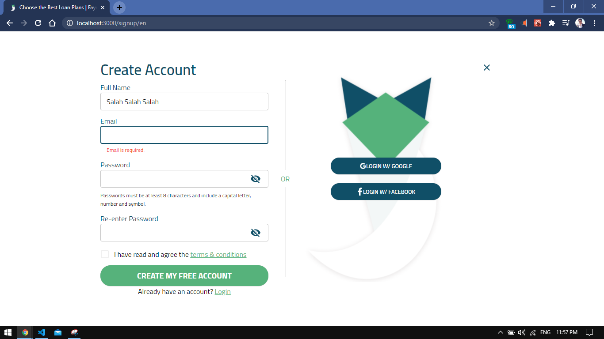
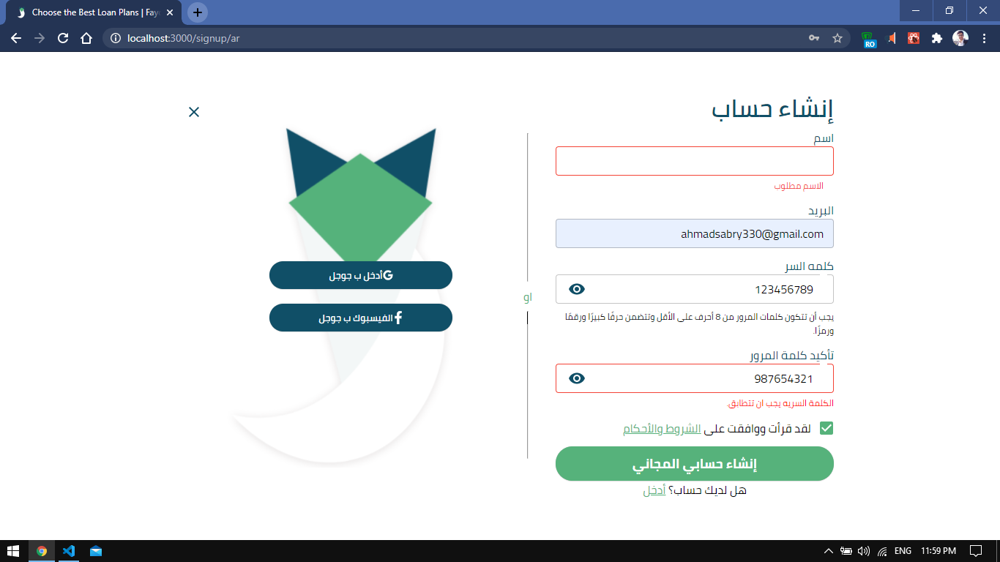
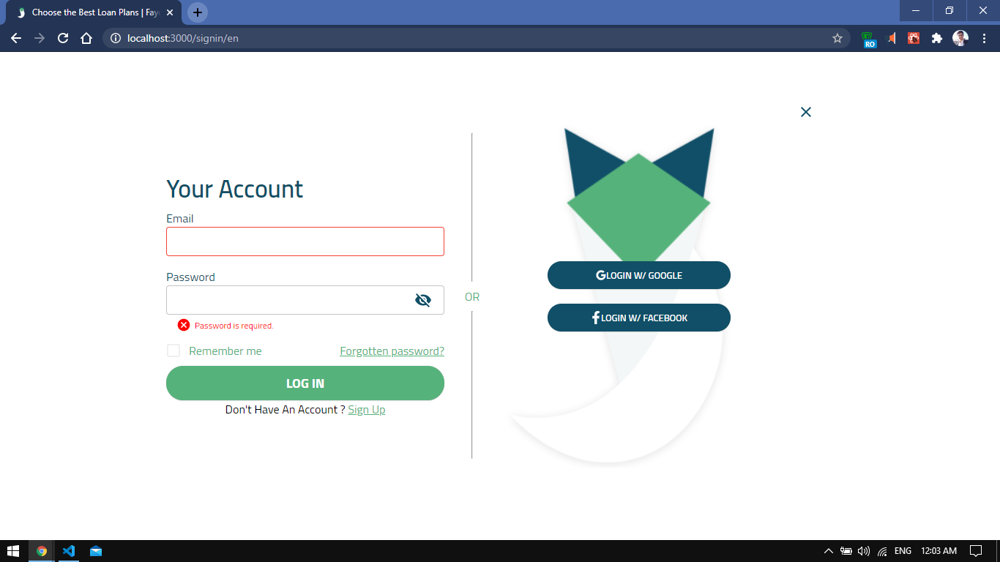
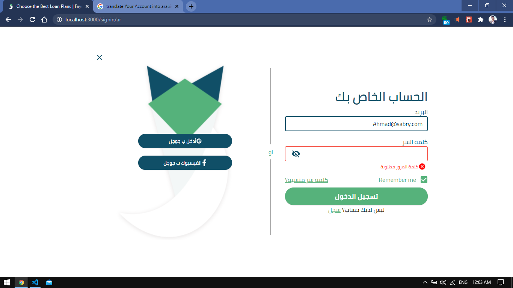
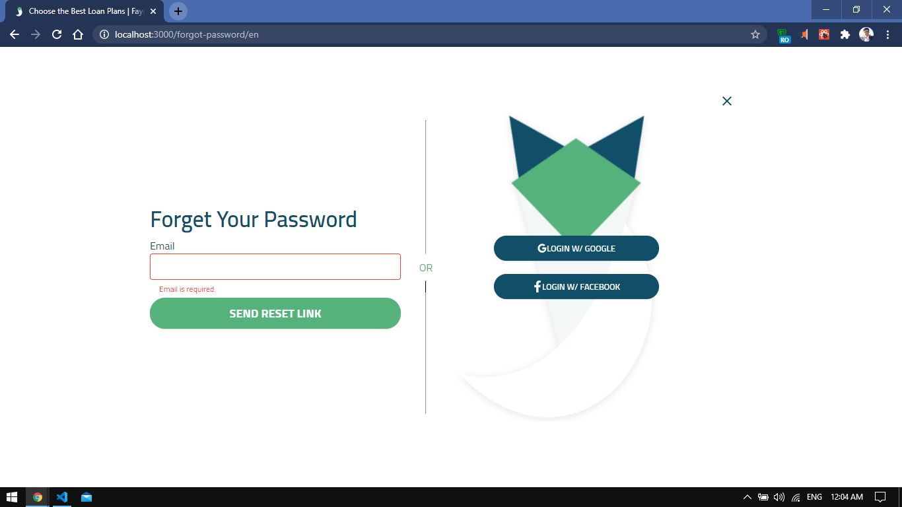
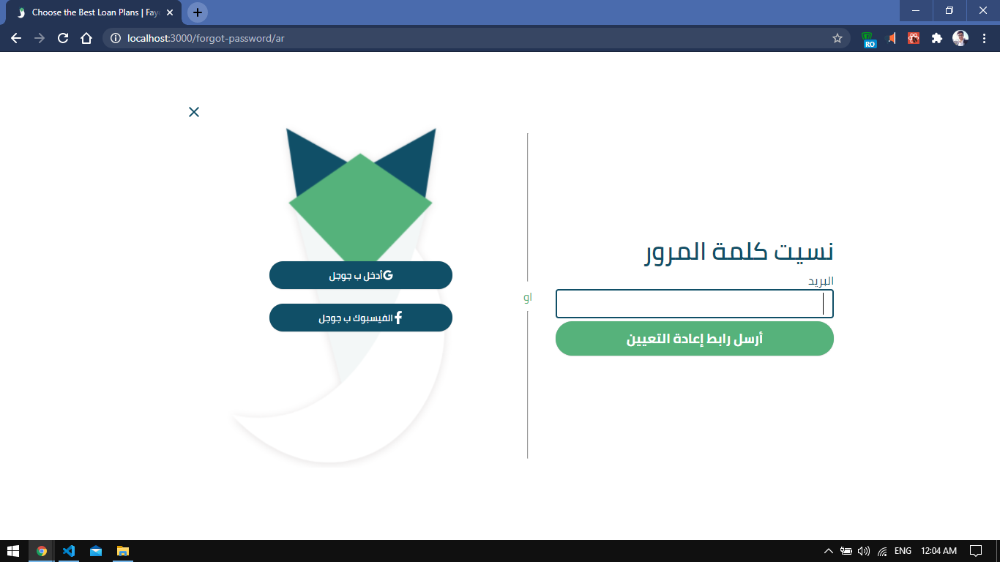
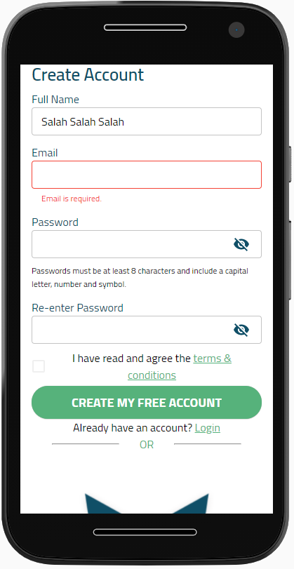
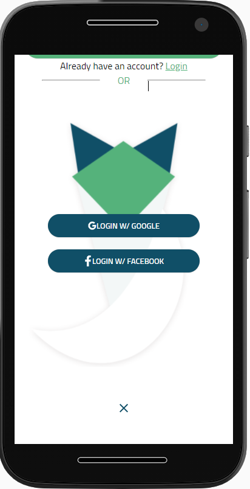

# Gebhaly

This project is a small task from gebhaly, Shopping Cart

## Technology

- React
- Material-UI
- Yup
- Formik

## Imp!

- Layout strcutre (navigation/index)
- Validate on change (any form using formik)
- Arabic English Translation (Page isn't rewritten in ar/en, check ```<Text/>``` component)
- Context API with custom hooks: ```useSettings```
- Material UI theme ```createMuiTheme()```

## Note

I intended to use firebase to actually implement the auth functionality but didn't have enough time. (Future work)

## Preview

<div style="display:flex; flex-direction:column; justify-content: center;">
    <h3>Create Account English/Arabic</h3>
    <p>http://localhost:3000/signup/en</p>
    <p>http://localhost:3000/signup/ar</p>
    <div style="display:flex; flex-direction:row">
        
        
    </div>
</div>

<div style="display:flex; flex-direction:column; justify-content: center;">
    <h3>Login English/Arabic</h3>
    <p>http://localhost:3000/signin/en</p>    
    <p>http://localhost:3000/signin/ar</p>
    <div style="display:flex; flex-direction:row">
        
        
    </div>
</div>


<div style="display:flex; flex-direction:column; justify-content: center;">
    <h3>Forgot Password English/Arabic</h3>
    <p>http://localhost:3000/forgot-password/en</p>    
    <p>http://localhost:3000/forgot-password/ar</p>
    <div style="display:flex; flex-direction:row">
        
        
    </div>
</div>


<div style="display:flex; flex-direction:column; justify-content: center;">
    <h3>Mobile Create Account parts 1 - 2</h3>
    <div style="display:flex; flex-direction:row">
        
        
    </div>
</div>

